Loan approval prediction
================
Mustafa Arslan
1/5/2021

``` r
library(keras)
library(dplyr)
```

    ## 
    ## Attaching package: 'dplyr'

    ## The following objects are masked from 'package:stats':
    ## 
    ##     filter, lag

    ## The following objects are masked from 'package:base':
    ## 
    ##     intersect, setdiff, setequal, union

``` r
library(tidyverse)
```

    ## -- Attaching packages --------------------------------------- tidyverse 1.3.0 --

    ## v ggplot2 3.3.2     v purrr   0.3.4
    ## v tibble  3.0.4     v stringr 1.4.0
    ## v tidyr   1.1.2     v forcats 0.5.0
    ## v readr   1.4.0

    ## -- Conflicts ------------------------------------------ tidyverse_conflicts() --
    ## x dplyr::filter() masks stats::filter()
    ## x dplyr::lag()    masks stats::lag()

``` r
library(recipes)
```

    ## 
    ## Attaching package: 'recipes'

    ## The following object is masked from 'package:stringr':
    ## 
    ##     fixed

    ## The following object is masked from 'package:stats':
    ## 
    ##     step

``` r
library(randomForest)
```

    ## randomForest 4.6-14

    ## Type rfNews() to see new features/changes/bug fixes.

    ## 
    ## Attaching package: 'randomForest'

    ## The following object is masked from 'package:ggplot2':
    ## 
    ##     margin

    ## The following object is masked from 'package:dplyr':
    ## 
    ##     combine

``` r
library(caret)
```

    ## Loading required package: lattice

    ## 
    ## Attaching package: 'caret'

    ## The following object is masked from 'package:purrr':
    ## 
    ##     lift

``` r
library(pROC)
```

    ## Type 'citation("pROC")' for a citation.

    ## 
    ## Attaching package: 'pROC'

    ## The following objects are masked from 'package:stats':
    ## 
    ##     cov, smooth, var

``` r
df<- read.csv("loan_train.csv")
head(df)
```

    ##   MIS_Status LoanNr_ChkDgt                           Name            City State
    ## 1      P I F    1122875008  Patty Schwartzkopf Properties   MAMMOTH LAKES    CA
    ## 2      P I F    4549584000 HAM DELLES COMPANY INCORPORATE      SANTA ROSA    CA
    ## 3      P I F    7408914003 MEGA CORPORATION GROUP,A CALIF          WALNUT    CA
    ## 4      P I F    4579774010    STICKS-N-STONES ENTERPRISES      SAN CARLOS    CA
    ## 5      P I F    6266254005        PREMIERE PROPERTIES INC      BURLINGAME    CA
    ## 6     CHGOFF    2735566002       D BOOKER ENTERPRISES INC SAN LUIS OBISPO    CA
    ##     Zip                           Bank BankState  NAICS ApprovalDate ApprovalFY
    ## 1 93546     BANK OF AMERICA NATL ASSOC        NC 531210        16413       2005
    ## 2 95401                    UMPQUA BANK        OR 531312        15126       2001
    ## 3 91789     BANK OF AMERICA NATL ASSOC        NC 532230        16195       2004
    ## 4 94070     WACHOVIA SBA LENDING, INC.        CA 531312        15141       2001
    ## 5 94010 U.S. BANK NATIONAL ASSOCIATION        OH 531210        15818       2003
    ## 6 93401 JPMORGAN CHASE BANK NATL ASSOC        IL 531210        17254       2007
    ##   Term NoEmp NewExist CreateJob RetainedJob FranchiseCode UrbanRural RevLineCr
    ## 1   84     2        1         0           0             1          2         Y
    ## 2  300     7        1         0           7             1          1         0
    ## 3   84     3        1         0           3             1          1         Y
    ## 4  300    10        1         0           0             1          1         N
    ## 5  300     2        1         0           2             1          1         0
    ## 6   46     1        1         1           1             1          2         Y
    ##   LowDoc DisbursementDate DisbursementGross BalanceGross  GrAppv SBA_Appv New
    ## 1      N            16587             11000            0   11000     5500   0
    ## 2      N            15156            866800            0  866800   650100   0
    ## 3      N            16222             77377            0   85000    42500   0
    ## 4      N            15218            800100            0  810000   607500   0
    ## 5      N            15917           1054200            0 1056200   766917   0
    ## 6      N            17256             98180            0   50000    25000   0
    ##   RealEstate   Portion Recession daysterm    xx
    ## 1          0 0.5000000         0     2520 19107
    ## 2          1 0.7500000         0     9000 24156
    ## 3          0 0.5000000         0     2520 18742
    ## 4          1 0.7500000         0     9000 24218
    ## 5          1 0.7261096         0     9000 24917
    ## 6          0 0.5000000         0     1380 18636

``` r
# Data Cleaning 1

#Assigning Missing values to Median values within the observation
median1<- median(df[,"DisbursementDate"], na.rm=T)
median2<- median(df[,"xx"], na.rm=T)
df[is.na(df$DisbursementDate),"DisbursementDate" ] <- median1
df[is.na(df$xx),"xx" ] <- median2 
df[is.na(df$NewExist),"NewExist"] <- 0
```

``` r
#Data Cleaning 2
str(df)
```

    ## 'data.frame':    1102 obs. of  31 variables:
    ##  $ MIS_Status       : chr  "P I F" "P I F" "P I F" "P I F" ...
    ##  $ LoanNr_ChkDgt    : num  1.12e+09 4.55e+09 7.41e+09 4.58e+09 6.27e+09 ...
    ##  $ Name             : chr  "Patty Schwartzkopf Properties" "HAM DELLES COMPANY INCORPORATE" "MEGA CORPORATION GROUP,A CALIF" "STICKS-N-STONES ENTERPRISES" ...
    ##  $ City             : chr  "MAMMOTH LAKES" "SANTA ROSA" "WALNUT" "SAN CARLOS" ...
    ##  $ State            : chr  "CA" "CA" "CA" "CA" ...
    ##  $ Zip              : int  93546 95401 91789 94070 94010 93401 90201 93638 95765 91360 ...
    ##  $ Bank             : chr  "BANK OF AMERICA NATL ASSOC" "UMPQUA BANK" "BANK OF AMERICA NATL ASSOC" "WACHOVIA SBA LENDING, INC." ...
    ##  $ BankState        : chr  "NC" "OR" "NC" "CA" ...
    ##  $ NAICS            : int  531210 531312 532230 531312 531210 531210 531210 531210 532490 531120 ...
    ##  $ ApprovalDate     : int  16413 15126 16195 15141 15818 17254 16161 17066 14868 15895 ...
    ##  $ ApprovalFY       : int  2005 2001 2004 2001 2003 2007 2004 2006 2000 2003 ...
    ##  $ Term             : int  84 300 84 300 300 46 294 289 60 120 ...
    ##  $ NoEmp            : int  2 7 3 10 2 1 3 5 5 5 ...
    ##  $ NewExist         : int  1 1 1 1 1 1 1 1 1 1 ...
    ##  $ CreateJob        : int  0 0 0 0 0 1 3 2 0 5 ...
    ##  $ RetainedJob      : int  0 7 3 0 2 1 3 5 5 5 ...
    ##  $ FranchiseCode    : int  1 1 1 1 1 1 1 68905 1 1 ...
    ##  $ UrbanRural       : int  2 1 1 1 1 2 1 1 1 1 ...
    ##  $ RevLineCr        : chr  "Y" "0" "Y" "N" ...
    ##  $ LowDoc           : chr  "N" "N" "N" "N" ...
    ##  $ DisbursementDate : num  16587 15156 16222 15218 15917 ...
    ##  $ DisbursementGross: int  11000 866800 77377 800100 1054200 98180 270000 1480000 64270 200000 ...
    ##  $ BalanceGross     : int  0 0 0 0 0 0 0 0 0 0 ...
    ##  $ GrAppv           : int  11000 866800 85000 810000 1056200 50000 270000 1493000 50000 200000 ...
    ##  $ SBA_Appv         : int  5500 650100 42500 607500 766917 25000 202500 1119750 25000 100000 ...
    ##  $ New              : int  0 0 0 0 0 0 0 0 0 0 ...
    ##  $ RealEstate       : int  0 1 0 1 1 0 1 1 0 0 ...
    ##  $ Portion          : num  0.5 0.75 0.5 0.75 0.726 ...
    ##  $ Recession        : int  0 0 0 0 0 0 0 0 0 0 ...
    ##  $ daysterm         : int  2520 9000 2520 9000 9000 1380 8820 8670 1800 3600 ...
    ##  $ xx               : num  19107 24156 18742 24218 24917 ...

``` r
df1 <- df %>%
  select(-c(LoanNr_ChkDgt, City, State, Zip, Name, Bank, BankState,NAICS, BalanceGross,NoEmp)) %>%
  mutate_at(vars(MIS_Status,Recession,UrbanRural,RevLineCr,
                 LowDoc,New,RealEstate,NewExist), list(factor))
```

``` r
#Data Preparation1
#Set levels for RevLineCr  & LowDoc & MIS_STATUS
levels(df1$RevLineCr) <- c("0","0","N","T","Y")
levels(df1$LowDoc)<-c("N","N","N","N","S","Y")
levels(df1$MIS_Status) <-c("No","Yes")
```

``` r
#Data Preparation 2
hist(df1$Portion)
```

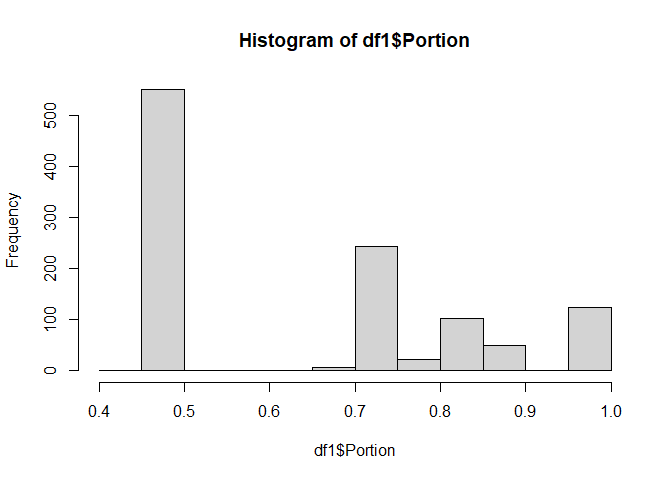<!-- -->

``` r
df1$Portion <- cut(x = df1$Portion, breaks = c(0,0.51,0.74,0.84,0.86,0.92,1.1),
                   labels = c("A1","A2", "A3","A4","A5", "A6") )
hist(df1$FranchiseCode)
```

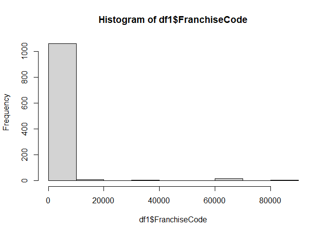<!-- -->

``` r
df1$FranchiseCode <- cut(x = df1$FranchiseCode, breaks = c(-.5,0.5,1.5,Inf),
                         labels = c("L1","L2", "L3") )
hist(df1$ApprovalFY)
```

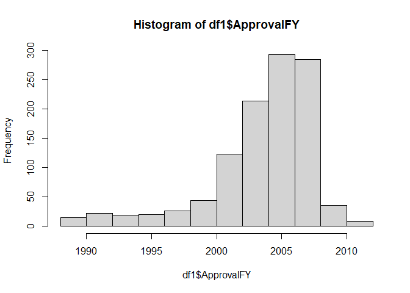<!-- -->

``` r
df1$ApprovalFY <- cut(df1$ApprovalFY, 4, include.lowest=TRUE, 
                      labels=c("A1","A2", "A3","A4") )
hist(df1$Term)
```

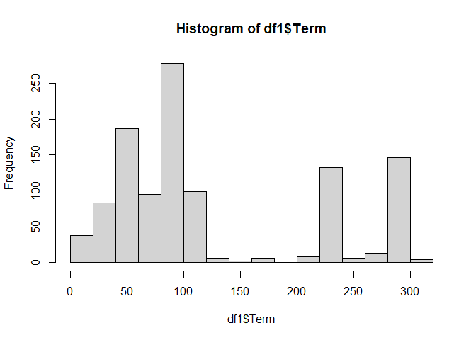<!-- -->

``` r
df1$Term <- cut(df1$Term, breaks = c(0,35,37,59,61,83,85,95,97,119,Inf),
                include.lowest=TRUE,labels=c(1:10))
hist(df1$CreateJob)
```

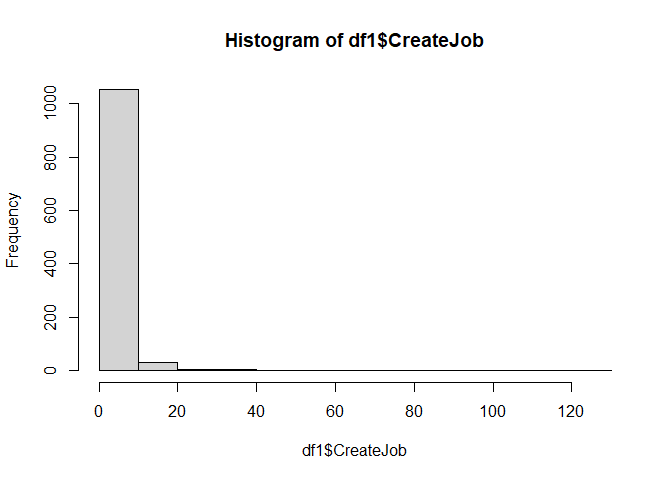<!-- -->

``` r
df1$CreateJob <- cut(df1$CreateJob, breaks= c(0,0.5,3,Inf), include.lowest=TRUE, 
                     labels=c("A1","A2", "A3") )
hist(df1$RetainedJob)
```

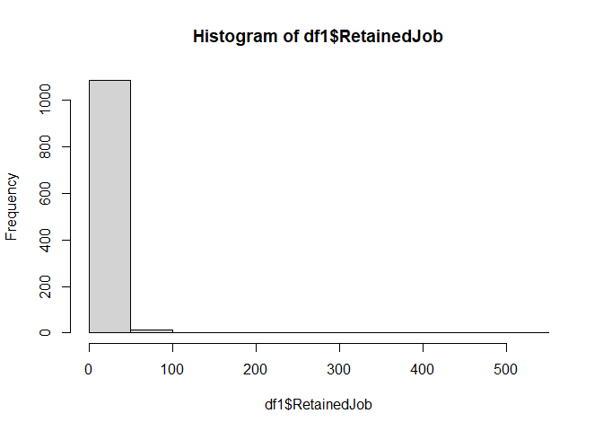<!-- -->

``` r
df1$RetainedJob <- cut(df1$RetainedJob, breaks= c(0,0.5,Inf), include.lowest=TRUE, 
                       labels=c("A1","A2") )

hist(df1$daysterm)
```

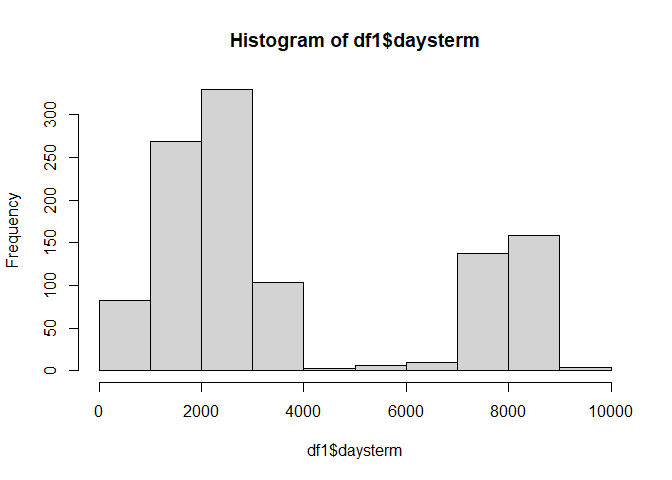<!-- -->

``` r
df1$daysterm <- cut(df1$daysterm, 
                    breaks = c(0,1070,1090,1640,1771,1810,2510,2530,3500,7000,Inf), 
                    include.lowest=TRUE, labels = c(1:10))

hist(df1$DisbursementDate)
```

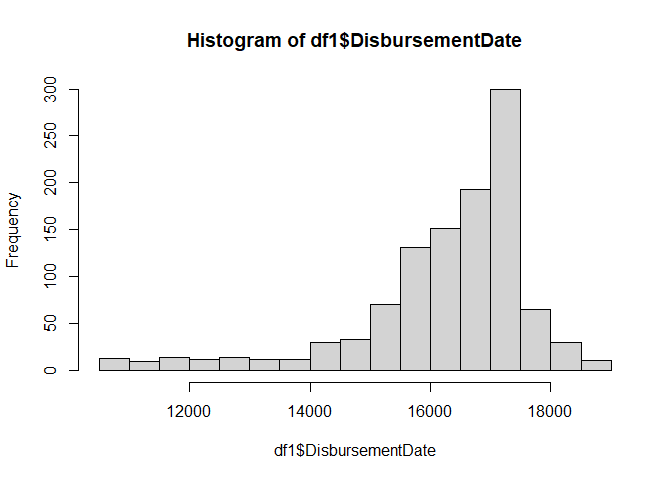<!-- -->

``` r
df1$DisbursementDate <- cut(df1$DisbursementDate, 
                            breaks = c(0,16420,Inf),labels = c("A1","A2"),
                            include.lowest=TRUE)
hist(df1$ApprovalDate)
```

<!-- -->

``` r
df1$ApprovalDate <- cut(df1$ApprovalDate, 
                        breaks = c(0,11320,11925,16045,16282,Inf), 
                        labels= c("A1","A2","A3","A4","A5"),include.lowest=TRUE)
hist(df1$xx)
```

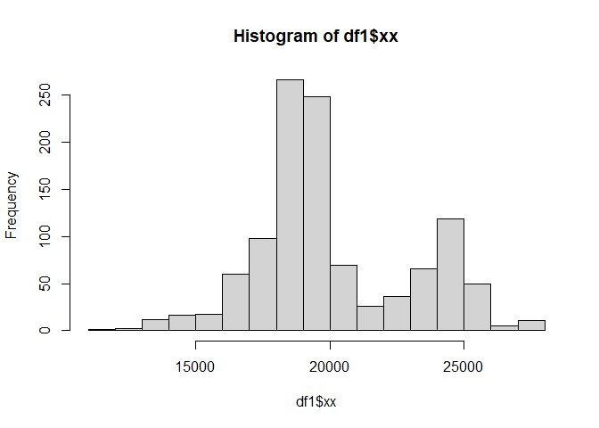<!-- -->

``` r
df1$xx <- cut(df1$xx, breaks = c(0,16750,18153,Inf), 
              labels= c("A1","A2","A3"),include.lowest=TRUE)
hist(df1$DisbursementGross)
```

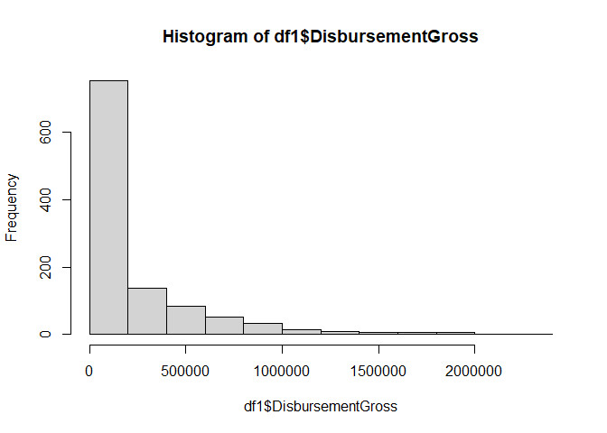<!-- -->

``` r
df1$DisbursementGross<- cut(df1$DisbursementGross,
                            breaks = c(0,9450,35100,42480,49600,140000,Inf), 
                            labels= c("A1","A2","A3","A4","A5","A6"),include.lowest=TRUE)
hist(df1$SBA_Appv)
```

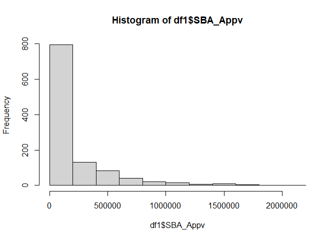<!-- -->

``` r
df1$SBA_Appv<- cut(df1$SBA_Appv,breaks = c(0,2600,17400,55000,Inf), 
                   labels= c("A1","A2","A3","A4"),include.lowest=TRUE)
hist(df1$GrAppv)
```

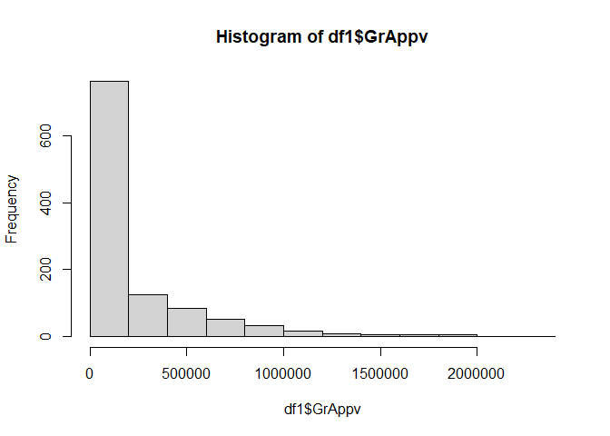<!-- -->

``` r
df1$GrAppv<- cut(df1$GrAppv,breaks = c(0,5100,16800,24900,34000,61000,99000,120000,Inf), 
                 labels= c("A1","A2","A3","A4","A5","A6","A7","A8"),
                 include.lowest=TRUE)
```

``` r
#  Data Partition
train_index =createDataPartition(df1$MIS_Status, p=.8,
                                 times=1,
                                 list=FALSE)
df1.train <- df1[train_index,]
df1.test  <- df1[-train_index,]

dim(df1)
```

    ## [1] 1102   21

``` r
dim(df1.train)
```

    ## [1] 882  21

``` r
dim(df1.test)
```

    ## [1] 220  21

``` r
#Preprocess the Data with Recipe Library
rec_obj <- recipe(MIS_Status ~ ., data = df1.train) %>%
  step_dummy(all_nominal(), -all_outcomes()) %>%
  prep(data = df1.train)
rec_obj
```

    ## Data Recipe
    ## 
    ## Inputs:
    ## 
    ##       role #variables
    ##    outcome          1
    ##  predictor         20
    ## 
    ## Training data contained 882 data points and no missing data.
    ## 
    ## Operations:
    ## 
    ## Dummy variables from ApprovalDate, ApprovalFY, Term, NewExist, ... [trained]

``` r
# Predictors
x_train <- bake(rec_obj, new_data = df1.train) %>% select(- MIS_Status)
x_test  <- bake(rec_obj, new_data = df1.test)  %>% select(- MIS_Status)

#Target
y_train <- ifelse(pull(df1.train, MIS_Status) == "Yes", 1, 0)
y_test  <- ifelse(pull(df1.test,  MIS_Status) == "Yes", 1, 0)
```

``` r
#Create Model
model1 <- keras_model_sequential()
```

    ## Warning in normalizePath(path.expand(path), winslash, mustWork): path[1]="C:
    ## \Users\myavu\Anacon\envs\rstudio-R/python.exe": The system cannot find the file
    ## specified

    ## Warning in normalizePath(path.expand(path), winslash, mustWork): path[1]="C:
    ## \Users\myavu\Anacon\envs\rstudio-R/python.exe": The system cannot find the file
    ## specified

``` r
#this variable(model) contains instructions below
model1 %>%
  layer_dense(units= 16,
              activation='relu',
              kernel_initializer = 'uniform',
              input_shape = ncol(x_train)) %>% # input layer
  
  layer_dropout(rate = 0.2) %>%         

  # layer_dense(units= 64,
  #             kernel_initializer = 'uniform',
  #             activation='relu') %>%               # 2nd hidden layer
  
  layer_dropout(rate = 0.4) %>%                    # Hidden layer for preventing overfitting
  
  layer_dense(units= 8,
              kernel_initializer = 'uniform',
              activation='relu') %>%               # 2nd hidden layer
  
  layer_dense(units=1,
              activation = 'sigmoid') %>%          # output layer
  # sigmoid is common for binary classification
  
  #Compile Model
  
  compile(optimizer =optimizer_adam(lr=0.003),
          loss = 'binary_crossentropy',
          metrics=c('accuracy'))

model1
```

    ## Model
    ## Model: "sequential"
    ## ________________________________________________________________________________
    ## Layer (type)                        Output Shape                    Param #     
    ## ================================================================================
    ## dense_2 (Dense)                     (None, 16)                      1040        
    ## ________________________________________________________________________________
    ## dropout_1 (Dropout)                 (None, 16)                      0           
    ## ________________________________________________________________________________
    ## dropout (Dropout)                   (None, 16)                      0           
    ## ________________________________________________________________________________
    ## dense_1 (Dense)                     (None, 8)                       136         
    ## ________________________________________________________________________________
    ## dense (Dense)                       (None, 1)                       9           
    ## ================================================================================
    ## Total params: 1,185
    ## Trainable params: 1,185
    ## Non-trainable params: 0
    ## ________________________________________________________________________________

``` r
# Fit the keras model to the training data
history <- fit(
  object           = model1, 
  x                = as.matrix(x_train), 
  y                = y_train,
  batch_size       = 50, 
  epochs           = 30,
  validation_split = 0.30
)

plot(history)
```

    ## `geom_smooth()` using formula 'y ~ x'

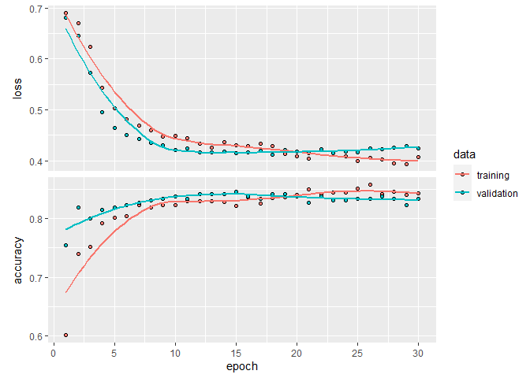<!-- -->

``` r
print(history)
```

    ## 
    ## Final epoch (plot to see history):
    ##         loss: 0.4073
    ##     accuracy: 0.8428
    ##     val_loss: 0.4239
    ## val_accuracy: 0.834

``` r
#Predicting the Test Data

#Probability prediction

x_test_prob <- predict_proba(object = model1, x = as.matrix(x_test)) %>%
  as.vector()

#Class prediction
x_test_class<- predict_classes(object = model1, x = as.matrix(x_test)) %>%
  as.vector()


y_test_class<-as.factor(y_test)
x_test_class <- as.factor(x_test_class)


Pred_Table<- table(y_test_class,x_test_class)
Pred_Table
```

    ##             x_test_class
    ## y_test_class   0   1
    ##            0  58  26
    ##            1  17 119

``` r
confusionMatrix(x_test_class,y_test_class)
```

    ## Confusion Matrix and Statistics
    ## 
    ##           Reference
    ## Prediction   0   1
    ##          0  58  17
    ##          1  26 119
    ##                                           
    ##                Accuracy : 0.8045          
    ##                  95% CI : (0.7459, 0.8548)
    ##     No Information Rate : 0.6182          
    ##     P-Value [Acc > NIR] : 1.955e-09       
    ##                                           
    ##                   Kappa : 0.5773          
    ##                                           
    ##  Mcnemar's Test P-Value : 0.2225          
    ##                                           
    ##             Sensitivity : 0.6905          
    ##             Specificity : 0.8750          
    ##          Pos Pred Value : 0.7733          
    ##          Neg Pred Value : 0.8207          
    ##              Prevalence : 0.3818          
    ##          Detection Rate : 0.2636          
    ##    Detection Prevalence : 0.3409          
    ##       Balanced Accuracy : 0.7827          
    ##                                           
    ##        'Positive' Class : 0               
    ## 

``` r
#RANDOM FOREST


model2 <- randomForest(MIS_Status~.,data=df1.train, importance=T, mtry=2)
model2
```

    ## 
    ## Call:
    ##  randomForest(formula = MIS_Status ~ ., data = df1.train, importance = T,      mtry = 2) 
    ##                Type of random forest: classification
    ##                      Number of trees: 500
    ## No. of variables tried at each split: 2
    ## 
    ##         OOB estimate of  error rate: 17.23%
    ## Confusion matrix:
    ##      No Yes class.error
    ## No  243  93   0.2767857
    ## Yes  59 487   0.1080586

``` r
prediction1 <- predict(model2, df1.test)
confusionMatrix(prediction1, df1.test$MIS_Status)
```

    ## Confusion Matrix and Statistics
    ## 
    ##           Reference
    ## Prediction  No Yes
    ##        No   62  13
    ##        Yes  22 123
    ##                                           
    ##                Accuracy : 0.8409          
    ##                  95% CI : (0.7858, 0.8866)
    ##     No Information Rate : 0.6182          
    ##     P-Value [Acc > NIR] : 4.035e-13       
    ##                                           
    ##                   Kappa : 0.6559          
    ##                                           
    ##  Mcnemar's Test P-Value : 0.1763          
    ##                                           
    ##             Sensitivity : 0.7381          
    ##             Specificity : 0.9044          
    ##          Pos Pred Value : 0.8267          
    ##          Neg Pred Value : 0.8483          
    ##              Prevalence : 0.3818          
    ##          Detection Rate : 0.2818          
    ##    Detection Prevalence : 0.3409          
    ##       Balanced Accuracy : 0.8213          
    ##                                           
    ##        'Positive' Class : No              
    ## 

``` r
#LOGISTIC REGRESSION
str(df1.train)
```

    ## 'data.frame':    882 obs. of  21 variables:
    ##  $ MIS_Status       : Factor w/ 2 levels "No","Yes": 2 2 2 2 2 1 2 2 2 2 ...
    ##  $ ApprovalDate     : Factor w/ 5 levels "A1","A2","A3",..: 5 3 4 3 3 5 4 3 3 3 ...
    ##  $ ApprovalFY       : Factor w/ 4 levels "A1","A2","A3",..: 3 3 3 3 3 4 3 2 3 3 ...
    ##  $ Term             : Factor w/ 10 levels "1","2","3","4",..: 6 10 6 10 10 3 10 4 10 10 ...
    ##  $ NewExist         : Factor w/ 2 levels "1","2": 1 1 1 1 1 1 1 1 1 1 ...
    ##  $ CreateJob        : Factor w/ 3 levels "A1","A2","A3": 1 1 1 1 1 2 2 1 3 1 ...
    ##  $ RetainedJob      : Factor w/ 2 levels "A1","A2": 1 2 2 1 2 2 2 2 2 2 ...
    ##  $ FranchiseCode    : Factor w/ 3 levels "L1","L2","L3": 2 2 2 2 2 2 2 2 2 2 ...
    ##  $ UrbanRural       : Factor w/ 3 levels "0","1","2": 3 2 2 2 2 3 2 2 2 2 ...
    ##  $ RevLineCr        : Factor w/ 4 levels "0","N","T","Y": 4 1 4 2 1 4 1 4 1 1 ...
    ##  $ LowDoc           : Factor w/ 3 levels "N","S","Y": 1 1 1 1 1 1 1 1 1 1 ...
    ##  $ DisbursementDate : Factor w/ 2 levels "A1","A2": 2 1 1 1 1 2 1 1 1 1 ...
    ##  $ DisbursementGross: Factor w/ 6 levels "A1","A2","A3",..: 2 6 5 6 6 5 6 5 6 6 ...
    ##  $ GrAppv           : Factor w/ 8 levels "A1","A2","A3",..: 2 8 6 8 8 5 8 5 8 8 ...
    ##  $ SBA_Appv         : Factor w/ 4 levels "A1","A2","A3",..: 2 4 3 4 4 3 4 3 4 4 ...
    ##  $ New              : Factor w/ 2 levels "0","1": 1 1 1 1 1 1 1 1 1 1 ...
    ##  $ RealEstate       : Factor w/ 2 levels "0","1": 1 2 1 2 2 1 2 1 1 2 ...
    ##  $ Portion          : Factor w/ 6 levels "A1","A2","A3",..: 1 3 1 3 2 1 3 1 1 3 ...
    ##  $ Recession        : Factor w/ 2 levels "0","1": 1 1 1 1 1 1 1 1 1 1 ...
    ##  $ daysterm         : Factor w/ 10 levels "1","2","3","4",..: 7 10 7 10 10 3 10 5 9 10 ...
    ##  $ xx               : Factor w/ 3 levels "A1","A2","A3": 3 3 3 3 3 3 3 1 3 3 ...

``` r
df1.train<- df1.train%>%
  select(-c(LowDoc))
df1.test<- df1.test%>%
  select(-c(LowDoc))


model3 <- glm(MIS_Status~.,data=df1.train, family= binomial(logit))
model3
```

    ## 
    ## Call:  glm(formula = MIS_Status ~ ., family = binomial(logit), data = df1.train)
    ## 
    ## Coefficients:
    ##         (Intercept)       ApprovalDateA2       ApprovalDateA3  
    ##            14.61235            -17.16999            -14.55444  
    ##      ApprovalDateA4       ApprovalDateA5         ApprovalFYA2  
    ##           -14.67394            -15.47586             -0.18669  
    ##        ApprovalFYA3         ApprovalFYA4                Term2  
    ##            -0.78281             -0.95014              1.32174  
    ##               Term3                Term4                Term5  
    ##            -0.19754              1.33064              0.25845  
    ##               Term6                Term7                Term8  
    ##           -14.79900              0.34022              0.73692  
    ##               Term9               Term10            NewExist2  
    ##            -0.07601              2.00072              0.19187  
    ##         CreateJobA2          CreateJobA3        RetainedJobA2  
    ##            -0.49096              0.11024             -0.19075  
    ##     FranchiseCodeL2      FranchiseCodeL3          UrbanRural1  
    ##             0.20437             -0.52822              0.20817  
    ##         UrbanRural2           RevLineCrN           RevLineCrT  
    ##             0.73969              0.10740              0.28115  
    ##          RevLineCrY   DisbursementDateA2  DisbursementGrossA2  
    ##             0.18995              0.11895             -1.35001  
    ## DisbursementGrossA3  DisbursementGrossA4  DisbursementGrossA5  
    ##            -1.67419             -0.03361             -1.35487  
    ## DisbursementGrossA6             GrAppvA2             GrAppvA3  
    ##            -0.47954              1.37565              0.73998  
    ##            GrAppvA4             GrAppvA5             GrAppvA6  
    ##             1.75637              2.06635              2.37037  
    ##            GrAppvA7             GrAppvA8           SBA_AppvA2  
    ##             1.94110              2.07135             -0.76295  
    ##          SBA_AppvA3           SBA_AppvA4                 New1  
    ##            -1.54354             -0.64063                   NA  
    ##         RealEstate1            PortionA2            PortionA3  
    ##             0.34539             13.34632             -1.01586  
    ##           PortionA4            PortionA5            PortionA6  
    ##             0.09809              0.19261             -0.52153  
    ##          Recession1            daysterm2            daysterm3  
    ##            -0.30203             -0.40964              0.22890  
    ##           daysterm4            daysterm5            daysterm6  
    ##                  NA              1.96809                   NA  
    ##           daysterm7            daysterm8            daysterm9  
    ##            18.49070                   NA                   NA  
    ##          daysterm10                 xxA2                 xxA3  
    ##                  NA             -0.04109              0.15310  
    ## 
    ## Degrees of Freedom: 881 Total (i.e. Null);  825 Residual
    ## Null Deviance:       1172 
    ## Residual Deviance: 689.3     AIC: 803.3

``` r
p2 <- predict(model3,df1.test,  type='response')
```

    ## Warning in predict.lm(object, newdata, se.fit, scale = 1, type = if (type == :
    ## prediction from a rank-deficient fit may be misleading

``` r
glm.pred =rep("No",220)
glm.pred[p2>=0.5]="Yes"
glm.pred <- as.factor(glm.pred)

length(df1.test$MIS_Status)
```

    ## [1] 220

``` r
length(glm.pred)
```

    ## [1] 220

``` r
confusionMatrix(glm.pred,df1.test$MIS_Status)
```

    ## Confusion Matrix and Statistics
    ## 
    ##           Reference
    ## Prediction  No Yes
    ##        No   62  11
    ##        Yes  22 125
    ##                                           
    ##                Accuracy : 0.85            
    ##                  95% CI : (0.7958, 0.8944)
    ##     No Information Rate : 0.6182          
    ##     P-Value [Acc > NIR] : 3.518e-14       
    ##                                           
    ##                   Kappa : 0.6741          
    ##                                           
    ##  Mcnemar's Test P-Value : 0.08172         
    ##                                           
    ##             Sensitivity : 0.7381          
    ##             Specificity : 0.9191          
    ##          Pos Pred Value : 0.8493          
    ##          Neg Pred Value : 0.8503          
    ##              Prevalence : 0.3818          
    ##          Detection Rate : 0.2818          
    ##    Detection Prevalence : 0.3318          
    ##       Balanced Accuracy : 0.8286          
    ##                                           
    ##        'Positive' Class : No              
    ## 

``` r
#AUC & ROC 
roc(df1.train$MIS_Status,model3$fitted.values , plot=T)
```

    ## Setting levels: control = No, case = Yes

    ## Setting direction: controls < cases

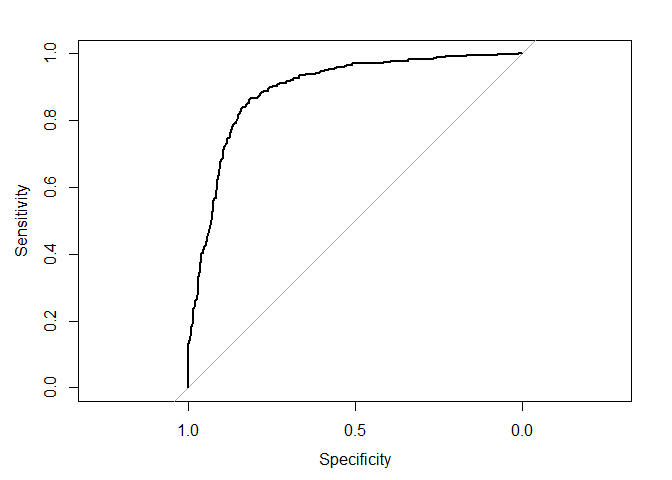<!-- -->

    ## 
    ## Call:
    ## roc.default(response = df1.train$MIS_Status, predictor = model3$fitted.values,     plot = T)
    ## 
    ## Data: model3$fitted.values in 336 controls (df1.train$MIS_Status No) < 546 cases (df1.train$MIS_Status Yes).
    ## Area under the curve: 0.8918
